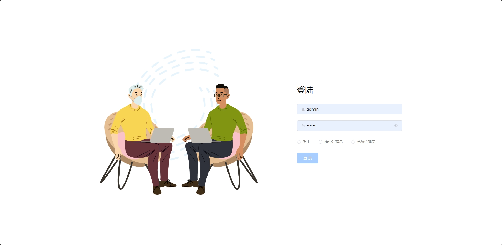
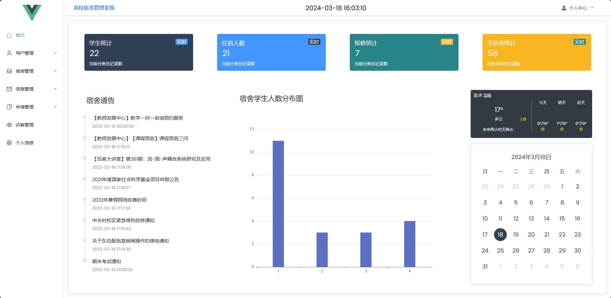
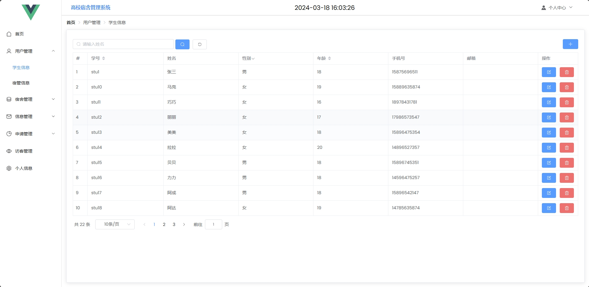
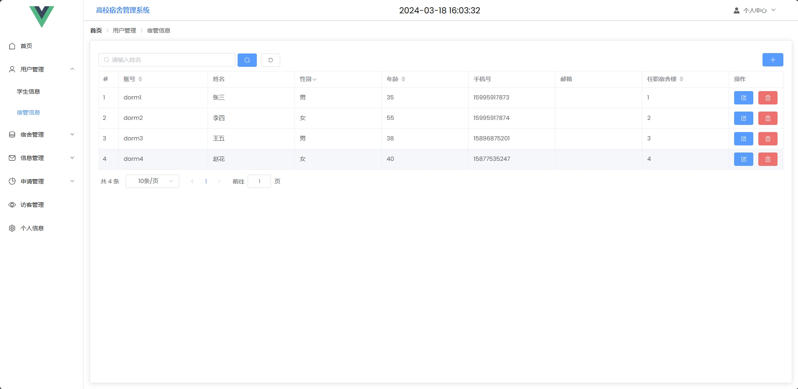
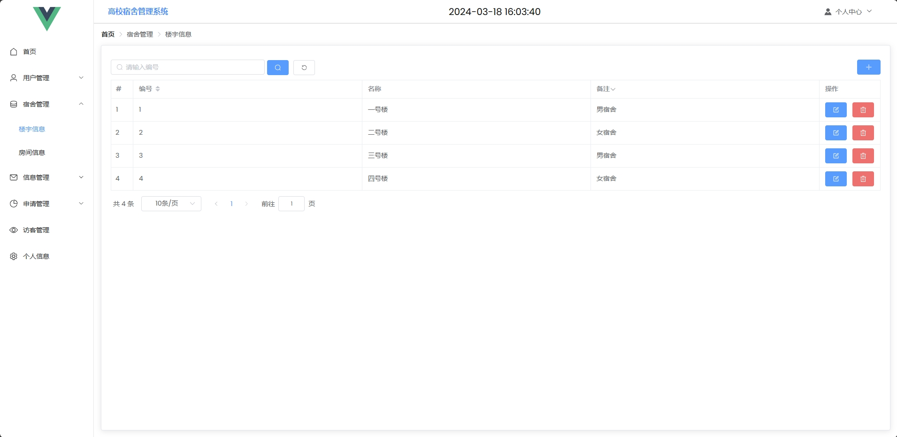
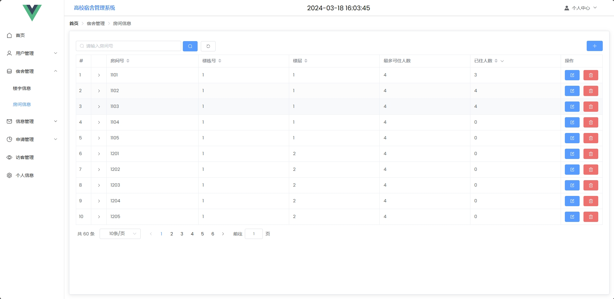
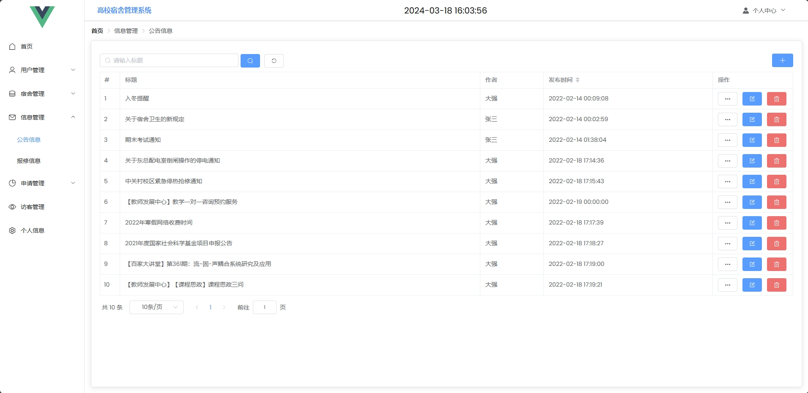

<h1 align="center">基于SSM框架的高校宿舍管理系统</h1>

 获取sql文件 QQ: 386869957 QQ群: 377586148 

 [个人站点: 从戎源码网](https://armycodes.com/)

## 简介

> 本代码来源于网络,仅供学习参考使用!
>
> 提供1.远程部署/2.修改代码/3.设计文档指导/4.框架代码讲解等服务
>
> 前端首页:  http://localhost:8080
>
> 管理员: admin 密码: 123456
>
> 宿管: dorm1 密码: 123456
>
> 学生：stu1 密码: 123456

## 项目介绍

基于SSM框架的高校宿舍管理系统：前端 Vue、ElementUI，后端 SpringBoot、Mybatis，系统角色分为：管理员、宿管和学生，管理员在管理后台录入房间信息，对访客进行管理，对报修工单进行审批，审批调宿申请；宿管对学生信息进行管理，审批调宿申请;学生根据安排的房间入住，可以对宿舍进行报修，主要功能如下：

### 启动方式

- 前端：
> cd vue
> 
> npm run serve

- 后端：
> 按钮启动 | 右键run SpringbootApplication

### 管理员：

- 基本操作：登录、修改头像、修改个人信息、上传图片、获取个人信息
- 用户管理：获取学生信息、编辑学生信息、删除学生信息、添加学生信息、筛选学生信息
- 宿管管理：获取宿管信息、编辑宿管信息、删除宿管信息、添加宿管信息、筛选宿管信息 
- 宿舍管理：获取楼宇信息、编辑楼宇信息、删除楼宇信息、添加楼宇信息、筛选楼宇信息、获取房间信息、编辑房间信息、删除房间信息、添加房间信息、筛选房间信息
- 信息管理：获取公告信息、编辑公告信息、删除公告信息、添加公告信息、筛选公告信息、获取报修信息、编辑报修信息、删除报修信息、添加报修信息、筛选报修信息、完成报修
- 申请管理：获取调宿信息、编辑调宿信息、删除调宿信息、添加调宿信息、筛选调宿信息、审批调宿
- 访客管理：获取访客信息、编辑访客信息、删除访客信息、添加访客信息、筛选访客信息

### 宿管：

- 基本操作：登录、修改头像、修改个人信息、上传图片、获取个人信息
- 用户管理：获取学生信息、编辑学生信息、删除学生信息、添加学生信息、筛选学生信息
- 宿舍管理：获取楼宇信息、编辑楼宇信息、删除楼宇信息、添加楼宇信息、筛选楼宇信息、获取房间信息、编辑房间信息、删除房间信息、添加房间信息、筛选房间信息
- 信息管理：获取报修信息、编辑报修信息、删除报修信息、添加报修信息、筛选报修信息、完成报修
- 申请管理：获取调宿信息、编辑调宿信息、删除调宿信息、添加调宿信息、筛选调宿信息、审批调宿
- 访客管理：获取访客信息、编辑访客信息、删除访客信息、添加访客信息、筛选访客信息

### 学生：

- 基本操作：登录、修改头像、修改个人信息、上传图片、获取个人信息
- 我的宿舍：获取房间信息、获取楼宇信息、获取床位信息
- 申请调宿：获取调宿信息、编辑调宿信息、添加调宿信息、筛选调宿信息
- 报修申请：获取报修信息、编辑报修信息、添加报修信息、筛选报修信息

## 环境

- <b>IntelliJ IDEA 2020.3</b>

- <b>Mysql 5.7.26</b>

- <b>NodeJs 14.17.3</b>

- <b>Maven 3.6.3</b>

- <b>JDK 1.8</b>

## 运行截图

